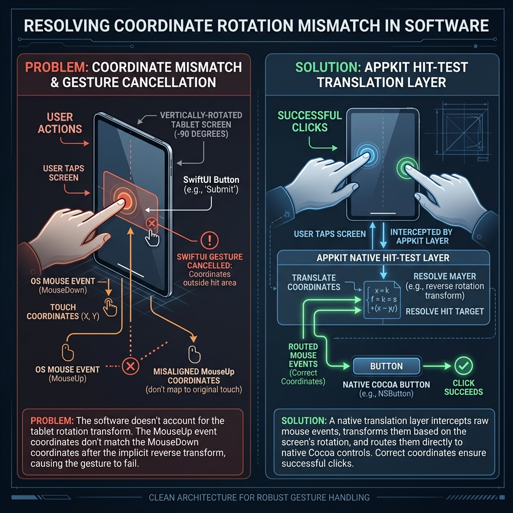

# Challenges: Event Coordinates Under Rotation

This document records our findings and technical details regarding why standard SwiftUI buttons and gestures fail to receive clicks when their parent view is rotated using AppKit's `frameCenterRotation`.

Here is a visual breakdown of how physical mouse events flow, why SwiftUI's internal gesture tracking fails, and how our native routing bypasses the issue.



## Coordinate Transformation and Event Routing Flow

```mermaid
flowchart TD
    subgraph Physical Screen Space
        A[Physical Click: Mouse Down at X, Y] --> B[Mouse Drag/Hold]
        B --> C[Physical Release: Mouse Up at X, Y]
    end

    subgraph AppKit Window Space (Rotated -90°)
        D[Window intercepts Event]
        D -->|Applies -90° Transform Matrix| E[Correctly Translated Coordinates]
    end

    subgraph SwiftUI Gesture Engine (Failure Path)
        E -->|Initiates Click Gesture| F[SwiftUI Button: Pressed State]
        C -->|Mouse Up Event fired| G[SwiftUI Gesture Tracker]
        G -->|FAIL: Does not apply Rotation Matrix to Mouse Up| H[Thinks Mouse Up is at raw screen coordinates]
        H -->|Determines release was outside button| I[Cancels Gesture / Button Click fails]
    end

    subgraph Native AppKit Event Routing (Success Path)
        D -->|Custom NSWindow hitTest| J{Is leaf view an NSButton?}
        J -->|Yes| K[Forward raw NSEvent directly to NSButton]
        K --> L[Native Cocoa tracking loop handles drag/release]
        L -->|SUCCESS| M[Action Triggered instantly and reliably]
    end

    style SwiftUI Gesture Engine fill:#7f1d1d,stroke:#f87171,color:#fee2e2
    style Native AppKit Event Routing fill:#064e3b,stroke:#34d399,color:#d1fae5
    style Physical Screen Space fill:#1e293b,stroke:#475569,color:#f1f5f9
    style AppKit Window Space fill:#1e1b4b,stroke:#4f46e5,color:#e0e7ff
```

## Description of the Mismatch

1. **The Core Mismatch**: When AppKit rotates a view hierarchy using `frameCenterRotation`, it updates the drawing context. However, SwiftUI's gesture tracker tracks drag-release sequences in parallel.
2. **The MouseUp Failure**: On `mouseDown`, coordinates are translated correctly. But on `mouseUp`, SwiftUI's tracking engine compares the release coordinate with the start coordinate without running it through the `-90°` transformation matrix.
3. **The Result**: SwiftUI thinks the user moved the mouse off the button before releasing, thereby cancelling the tap gesture.
4. **The Fix**: Our native `hitTest` override detects the click targets and routes the event directly to standard AppKit `NSButton` views (via `NSViewRepresentable`), which use native tracking loops that do not suffer from this declarative coordinate mismatch.

## Why the Browser Tab is Unaffected

The Browser Tab (Tab 0) is driven by `FocusableWebView` (which wraps AppKit's native `WKWebView`). Native AppKit views do not route mouse clicks through SwiftUI's gesture engine.

When a programmatic click is dispatched via `win.sendEvent(down)` and `win.sendEvent(up)` at physical coordinates, standard AppKit window routing delivers the events directly to `WKWebView`'s native tracking system. The web view processes the mouse down and mouse up events in its own coordinates, bypassing SwiftUI's gesture validation. Consequently, the coordinate translation mismatch on mouse-up (which is unique to SwiftUI's gesture engine) never gets triggered.

## Failed Coordinate Conversion Override Attempt

### What was attempted
To fix coordinate alignments and click issues without using manual event forwarding, we attempted to override the coordinate conversion functions (`convert(_:from:)`, `convert(_:to:)`, `convert(_:from: rect)`, and `convert(_:to: rect)`) in `RotatedHostingView` to dynamically transform coordinate spaces during mouse event dispatch. We used a state flag set in `sendEvent` (`EventForwardingState.isProcessingMouseEvent`) to scope this custom mapping strictly to active mouse events.

### Why it failed (and broke Settings tab clicks completely)
1. **SwiftUI Event Loop Instability**: Overriding `convert` on `RotatedHostingView` during mouse events interfered with how SwiftUI’s `NSHostingView` resolves mouse tracking sequences. Even when scoped to event dispatch, SwiftUI's internal drag/click recognition loops perform nested conversions that became inconsistent or double-rotated when the parent view returned custom logical/physical offsets.
2. **Settings Tab Inaccessibility**: Because the Settings tab is built using pure SwiftUI elements, it is entirely reliant on SwiftUI's coordinate tracking to recognize click states. The overridden coordinate conversions corrupted the relative delta computation inside the SwiftUI gesture tracker, causing it to completely ignore clicks on settings inputs (buttons, toggles, text fields).
3. **Conclusion**: Custom `convert(_:from:)` and `convert(_:to:)` overrides cannot be used on `NSHostingView` to handle parent visual rotations, because they break the internal alignment of SwiftUI's gesture recognition engine. Manual event forwarding remains the only viable way to send mouse inputs to SwiftUI elements inside a rotated parent view.
